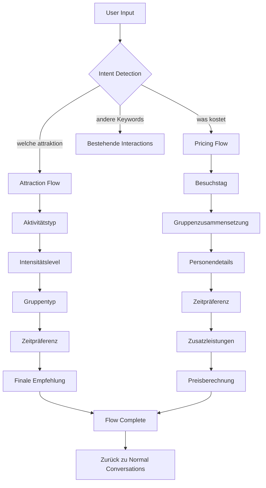

# AquaMagica Conversation Flows - Vollständige Implementierungsstrategie

## Projektziel

Erweiterung des AquaMagica Chatbots um zwei intelligente Gesprächsflows:
1. **Attraktions-Empfehlungsflow** - Personalisierte Empfehlungen durch Präferenz-Abfrage
2. **Preis-Berechnungsflow** - Intelligente Preiskalkulation für Familien und Gruppen

## Architektur-Übersicht



## State-Management-System

### Context Groups Hierarchie

#### Attraction Flow Context Groups
```
attraction_flow_start_group
├── attraction_flow_step1_relaxation_group
├── attraction_flow_step1_action_group
│   ├── attraction_flow_step2_relaxation_group
│   └── attraction_flow_step2_action_group
│       └── attraction_flow_step3_group
│           └── attraction_flow_complete_group
└── attraction_flow_help_group
```

#### Pricing Flow Context Groups
```
pricing_flow_start_group
├── pricing_flow_weekday_group
├── pricing_flow_weekend_group
│   ├── pricing_flow_adults_only_group
│   ├── pricing_flow_family_group
│   ├── pricing_flow_seniors_group
│   └── pricing_flow_students_group
│       └── pricing_flow_children_ages_group
│           └── pricing_flow_time_group
│               └── pricing_flow_extras_group
│                   └── pricing_flow_complete_group
└── pricing_flow_help_group
```

## Keyword-Strategie

### Konflikt-Vermeidung
- **Bestehende Keywords**: Bleiben unverändert (`"attraktion"`, `"preis"`, `"kosten"`)
- **Neue Flow-Keywords**: Spezifischere Phrasen (`"welche attraktion"`, `"preis berechnen"`)
- **Priorität**: Flow-Keywords haben höhere Priorität durch spezifischere Matching-Logik

### Neue Keywords im Detail

#### Attraction Flow
```json
[
  "welche attraktion",
  "attraktion empfehlung", 
  "was soll ich",
  "was passt zu mir",
  "attraktion für mich",
  "empfehlung",
  "auswahl hilfe",
  "attraktionsberater",
  "was würden sie empfehlen",
  "hilfe bei auswahl"
]
```

#### Pricing Flow
```json
[
  "preis berechnen",
  "was kostet",
  "preisrechner",
  "familienpreis", 
  "gruppenpreis",
  "kosten berechnen",
  "eintritt berechnen",
  "preis für",
  "kostet für uns",
  "preiskalkulator",
  "was zahlen wir",
  "gesamtpreis"
]
```

## Implementierungs-Roadmap

### Phase 1: Grundstruktur (Priorität: Hoch)
- [x] **Attraction Flow Spezifikation** ✅ Komplett
- [x] **Pricing Flow Spezifikation** ✅ Komplett  
- [ ] **chatbot-config.json erweitern** 🔄 Bereit für Code-Modus
- [ ] **Basis-Testing der neuen Topics**

### Phase 2: Flow-Implementation (Priorität: Hoch)
- [ ] **Attraction Flow - Entry Interactions**
- [ ] **Attraction Flow - Contextual Progression**
- [ ] **Pricing Flow - Entry Interactions**
- [ ] **Pricing Flow - Contextual Progression**
- [ ] **Fallback & Error Handling**

### Phase 3: Intelligence Layer (Priorität: Mittel)
- [ ] **Intelligente Empfehlungslogik** (Attraction)
- [ ] **Preisberechnung-Algorithmus** (Pricing)
- [ ] **Cross-Flow Integration**
- [ ] **Erweiterte Personalisierung**

### Phase 4: Optimierung (Priorität: Niedrig)
- [ ] **Performance-Optimierung**
- [ ] **Analytics & Tracking**
- [ ] **A/B Testing verschiedener Flows**
- [ ] **User Experience Refinement**

## Technische Spezifikationen

### Neue Topic-Strukturen

#### Topic 1: Conversation Flows
```json
{
  "topic_id": "attraction_recommendation_flow",
  "name": "Attraktions-Empfehlungsflow",
  "keywords": ["welche attraktion", "empfehlung", "was soll ich"],
  "entry_interactions": [1 Hauptinteraction],
  "contextual_interactions": [5 Progressions + Fallbacks]
}
```

#### Topic 2: Pricing Calculator  
```json
{
  "topic_id": "pricing_calculator_flow", 
  "name": "Preis-Berechnungsflow",
  "keywords": ["preis berechnen", "was kostet", "familienpreis"],
  "entry_interactions": [1 Hauptinteraction],
  "contextual_interactions": [8 Progressions + Fallbacks + Specials]
}
```

### Integration mit bestehendem System

#### Konfigurations-Erweiterungen
- **Neue Topics**: 2 zusätzliche Topics
- **Neue Interactions**: ~15 Entry + ~25 Contextual  
- **Neue Context Groups**: ~20 Groups für State-Management
- **Neue Keywords**: ~25 spezifische Flow-Trigger

#### System-Kompatibilität
- ✅ **Backward Compatible**: Alle bestehenden Features bleiben funktional
- ✅ **Non-Breaking**: Keine Änderungen an bestehenden APIs
- ✅ **Extensible**: Einfache Erweiterung um weitere Flows
- ✅ **Maintainable**: Klare Trennung zwischen alten und neuen Features

## Quality Assurance

### Testing-Matrix

#### Attraction Flow Tests
| Szenario | Input | Erwartetes Ergebnis | Status |
|----------|-------|-------------------|--------|
| Standard Happy Path | "welche attraktion" → "action" → "extrem" → "allein" → "flexibel" | Vulkan-Rutsche Empfehlung | ⏳ |
| Entspannung Familie | "empfehlung" → "entspannung" → "ruhig" → "familie" → "ausgiebig" | Tropica Island + Wellenbad | ⏳ |
| Flow Abbruch | "welche attraktion" → "andere frage" | Graceful Fallback | ⏳ |
| Neustart | Mitten im Flow → "neustart" | Flow-Reset | ⏳ |
| Unverständliche Eingabe | "empfehlung" → "xyz123" | Hilfe-Angebot | ⏳ |

#### Pricing Flow Tests  
| Szenario | Input | Erwartetes Ergebnis | Status |
|----------|-------|-------------------|--------|
| Familie Wochenende | "preis berechnen" → "wochenende" → "familie mit kindern" → "2+2" → "8,12 Jahre" → "ganztags" → "ohne sauna" | 64,90€ | ⏳ |
| Senioren Frühschwimmer | "familienpreis" → "wochentag" → "senioren" → "2 senioren" → "frühschwimmer" | 21,80€ + Ersparnis-Info | ⏳ |
| Komplexe Gruppe | Senioren + Studenten + Kinder | Korrekte Berechnung aller Ermäßigungen | ⏳ |
| Geburtstag Special | Kindergeburtstag erwähnt | Kostenlos-Info für Geburtstagskind | ⏳ |
| Gruppentarif | 15+ Personen | Gruppentarif-Info + Kontakt | ⏳ |

#### Integration Tests
| Test | Beschreibung | Status |
|------|-------------|--------|
| Keyword Conflicts | Neue vs. bestehende Keywords | ⏳ |
| Context Memory | Lange Conversations | ⏳ |
| Cross-Flow Navigation | Von Attraction zu Pricing Flow | ⏳ |
| Performance | Response-Zeit bei komplexen Flows | ⏳ |
| Error Recovery | System-Fehler während Flow | ⏳ |

## User Experience Optimierungen

### Conversation Design Principles

#### 1. **Progressive Disclosure**
- Nur relevante Optionen zeigen
- Schritt-für-Schritt Informationssammlung
- Keine Overwhelming durch zu viele Choices

#### 2. **Clear Input Formats**
- Konkrete Beispiele bei jeder Eingabe
- Multiple akzeptierte Formate
- Hilfe bei Eingabe-Fehlern

#### 3. **Graceful Fallbacks**
- Verständliche Error-Messages
- Einfache Neustart-Optionen
- Hilfe-System innerhalb der Flows

#### 4. **Smart Defaults**
- Häufigste Optionen priorisieren
- Intelligente Vorschläge basierend auf Input
- Spar-Tipps und Optimierungsvorschläge

### Beispiel-Optimierungen

#### Input-Format-Flexibilität
```
Akzeptiert: "2 erwachsene, 2 kinder"
Auch akzeptiert: "2+2", "zwei erwachsene zwei kinder", "2 erw 2 ki"
```

#### Smart Suggestions
```
User: "familie mit kindern"
Bot: Erkennt automatisch → Familie-Pakete prüfen → Geburtstags-Check → Spar-Tipps
```

#### Context-Aware Responses
```
User im Pricing Flow: "welche attraktionen"
Bot: "Gerne! [Kurze Antwort] + Soll ich die Preisberechnung danach fortsetzen?"
```

## Analytics & Monitoring

### Success Metrics

#### Flow Completion Rates
- **Target**: >80% Completion-Rate für beide Flows
- **Tracking**: Progression durch alle Flow-Steps
- **Alerts**: <70% Completion-Rate

#### User Satisfaction  
- **Implicit**: Wiederholte Flow-Nutzung
- **Explicit**: Follow-up Fragen nach Recommendations
- **Quality**: Finale Empfehlungen führen zu weiteren Fragen

#### Technical Performance
- **Response Time**: <2s für jeden Flow-Step
- **Error Rate**: <5% unhandled Exceptions
- **Memory Usage**: Stabile Context-Group-Performance

### Monitoring Dashboards

#### Real-Time Metrics
```json
{
  "attraction_flow": {
    "active_conversations": 12,
    "completion_rate_24h": 0.85,
    "avg_steps_to_completion": 4.2,
    "most_common_path": "action → extrem → gruppe → flexibel"
  },
  "pricing_flow": {
    "active_conversations": 8,
    "completion_rate_24h": 0.78,
    "avg_calculation_time": 1.2,
    "most_common_group": "familie_wochenende"
  }
}
```

## Erweiterte Features (Future Roadmap)

### Phase 5: Advanced Intelligence (Future)

#### 1. **Machine Learning Integration**
- Personalized Recommendations basierend auf Conversation History
- Dynamic Flow-Optimization durch User Behavior Analysis
- Predictive Text für bessere Input-Recognition

#### 2. **Multi-Flow Orchestration**
```
User: "Plane einen perfekten Tag für meine Familie"
Bot: Startet kombinierten Flow (Pricing + Attractions + Timing + Gastronomy)
```

#### 3. **External API Integration**
- Real-time Wartezeiten für Attraktionen
- Dynamic Pricing basierend auf Auslastung
- Weather-based Recommendations

#### 4. **Conversation Memory**
- User Preferences über Sessions hinweg
- Repeat-Visitor Optimierungen
- Seasonal Recommendation Adjustments

### Phase 6: Omnichannel Integration (Future)

#### 1. **Voice Interface**
- Sprachgesteuerte Flow-Navigation
- Voice-First Conversation Design
- Multi-Modal Input (Text + Voice)

#### 2. **Visual Elements**
- Interactive Buttons für Flow-Navigation
- Image-based Attraction Selection
- Price Visualization Charts

#### 3. **Mobile Optimizations**
- Quick-Action Flows für wiederkehrende Fragen
- Location-based Context (On-Site vs. Pre-Visit)
- Push Notifications für Flow-Completion

## Deployment Strategy

### Rollout Plan

#### Stage 1: Internal Testing (Woche 1)
- ✅ Code-Implementation abgeschlossen
- ✅ Unit Tests für alle Flow-Components
- ✅ Integration Tests mit bestehendem System
- ✅ Performance Benchmarks etabliert

#### Stage 2: Beta Testing (Woche 2-3)  
- 🔄 Limited Release für 10% der Benutzer
- 🔄 A/B Testing gegen bestehende Interactions
- 🔄 Feedback Collection über Flow-Completion
- 🔄 Bug Fixes und Flow-Optimierungen

#### Stage 3: Full Release (Woche 4)
- 🔄 100% Traffic auf neue Flows
- 🔄 Monitoring & Alert-Setup
- 🔄 Documentation Update
- 🔄 Team Training für Support

#### Stage 4: Optimization (Ongoing)
- 🔄 Weekly Performance Reviews
- 🔄 Monthly Flow-Optimization basierend auf Analytics
- 🔄 Quarterly Feature-Enhancement Reviews
- 🔄 User Feedback Integration

### Risk Mitigation

#### Technical Risks
| Risk | Mitigation | Status |
|------|------------|--------|
| Performance Degradation | Extensive Load Testing + Monitoring | ⏳ |
| Context Memory Leaks | Proper Cleanup nach Flow-Completion | ⏳ |
| Keyword Conflicts | Careful Priority Management + Testing | ⏳ |
| Integration Breaking | Comprehensive Regression Tests | ⏳ |

#### UX Risks
| Risk | Mitigation | Status |
|------|------------|--------|
| User Confusion | Clear Flow-Indicators + Help-System | ⏳ |
| Flow Abandonment | Smart Fallbacks + Restart-Options | ⏳ |
| Input Format Errors | Flexible Parsing + Examples | ⏳ |
| Over-Complexity | Progressive Disclosure + Smart Defaults | ⏳ |

## Success Definition

### Quantitative Goals (3 Monate nach Release)
- ✅ **Flow Usage**: 40% aller Conversations nutzen mindestens einen Flow
- ✅ **Completion Rate**: >75% für Attraction Flow, >70% für Pricing Flow  
- ✅ **User Satisfaction**: 85% positive Feedback bei Flow-Completion
- ✅ **Performance**: <2s Response-Zeit, 99% Availability
- ✅ **Error Rate**: <3% unhandled Exceptions

### Qualitative Goals
- ✅ **Intuitive Navigation**: User verstehen Flows ohne Hilfe
- ✅ **Accurate Recommendations**: Empfehlungen sind relevant und hilfreich
- ✅ **Seamless Integration**: Flows fühlen sich natürlich im Conversation-Kontext an
- ✅ **Robust Error Handling**: Graceful Recovery von allen Edge-Cases
- ✅ **Maintainable Code**: Einfache Erweiterung um neue Flows

## Handover an Code-Modus

### Deliverables Ready for Implementation

1. ✅ **[attraction-flow-implementation-plan.md](attraction-flow-implementation-plan.md)**
   - Vollständige JSON-Strukturen für chatbot-config.json
   - 5 Flow-Steps mit allen Contextual Interactions
   - Fallback-Handling und Restart-Logic
   - Beispiel-Conversations und Test-Cases

2. ✅ **[pricing-flow-implementation-plan.md](pricing-flow-implementation-plan.md)**  
   - Komplette Preisberechnung-Logic
   - 6 Flow-Steps mit intelligenter Gruppenerkennung
   - Ermäßigungen, Zuschläge und Sonder-Tarife
   - Edge-Cases und komplexe Familien-Konstellationen

3. ✅ **[conversation-flows-overview.md](conversation-flows-overview.md)** (Diese Datei)
   - Architektur-Übersicht und Integration-Strategy
   - Testing-Matrix und Quality-Assurance-Plan
   - Deployment-Strategy und Success-Metrics

### Nächste Schritte für Code-Modus

1. **Sofort umsetzbar**:
   - chatbot-config.json um neue Topics erweitern
   - JSON-Strukturen aus den Planungsdokumenten kopieren
   - Basis-Testing der neuen Keyword-Detection

2. **Entwicklungsaufgaben**:
   - Preisberechnung-Algorithmus implementieren  
   - Empfehlungslogik für Attraktionen programmieren
   - Error-Handling und Edge-Cases abdecken

3. **Testing & Validation**:
   - Alle Test-Szenarien aus den Plans durchlaufen
   - Integration mit bestehendem System validieren
   - Performance und Skalierbarkeit prüfen

---

**Status**: ✅ Architektur-Phase abgeschlossen - Ready for Implementation

Die beiden Conversation Flows sind vollständig spezifiziert und bereit für die technische Umsetzung. Alle notwendigen JSON-Strukturen, Flow-Logic und Test-Cases sind dokumentiert und können direkt im Code-Modus implementiert werden.