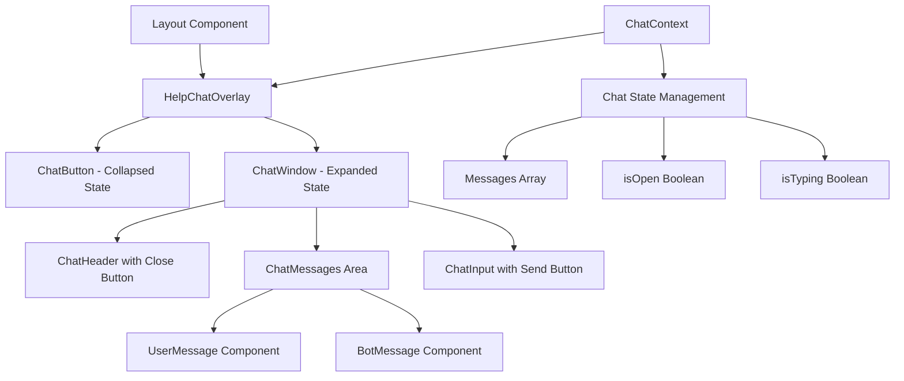

# Help Chat Overlay Implementation Plan

## Project Overview
We'll create a React help chat overlay component for the AquaMagica website using shadcn/ui components, Tailwind CSS, and the existing theme system. The chat will be positioned in the bottom-right corner and be available across all pages.

## Architecture Overview



## Implementation Steps

### Phase 1: Core Infrastructure & Types
1. **Create chat types and interfaces**
   - `src/types/chat.ts` - Message interface, chat state types
   - Message types: user, bot, system
   - Chat state management interfaces

2. **Create chat context and hook**
   - `src/contexts/chat-context.tsx` - Chat state management
   - `src/hooks/use-chat.ts` - Custom hook for chat operations
   - Initial bot welcome message: "Hallo, wie kann ich dir helfen?"

### Phase 2: Required shadcn/ui Components
3. **Add missing shadcn components**
   - `Input` component for message input
   - `Avatar` component for chat bubbles
   - `ScrollArea` component for message area

### Phase 3: Chat UI Components
4. **Create message bubble components**
   - `src/components/chat/user-message.tsx` - User message bubble (right-aligned, primary color)
   - `src/components/chat/bot-message.tsx` - Bot message bubble (left-aligned, secondary color)
   - `src/components/chat/typing-indicator.tsx` - Animated dots for bot typing

5. **Create chat input component**
   - `src/components/chat/chat-input.tsx` - Input field with send button
   - Enter key support for sending messages
   - Disabled state while bot is typing

6. **Create chat messages area**
   - `src/components/chat/chat-messages.tsx` - Scrollable message container
   - Auto-scroll to bottom on new messages
   - Empty state handling

### Phase 4: Main Chat Components
7. **Create chat header**
   - `src/components/chat/chat-header.tsx` - Header with title and close button
   - Title: "Hilfe & Support" 
   - Close button using `X` icon from lucide-react

8. **Create chat window**
   - `src/components/chat/chat-window.tsx` - Main chat container
   - Responsive sizing: 80% width on mobile, 400px on desktop
   - Height: 500px on desktop, 70vh on mobile
   - Fixed positioning in bottom-right

9. **Create chat button (collapsed state)**
   - `src/components/chat/chat-button.tsx` - Floating help button
   - Help icon + "Help" text
   - Hover effects and animations
   - Badge for unread messages (future enhancement)

### Phase 5: Main Chat Overlay
10. **Create main help chat overlay**
    - `src/components/help-chat-overlay.tsx` - Main component
    - Conditional rendering: ChatButton vs ChatWindow
    - State management integration
    - Animation transitions between states

### Phase 6: Integration & Mock Bot Logic
11. **Add chat service for bot responses**
    - `src/services/chat-service.ts` - Mock bot response logic
    - Predefined German responses based on keywords
    - setTimeout to simulate thinking delay (1-2 seconds)
    - Console logging of user messages

12. **Integrate with layout**
    - Update `src/components/layout.tsx` to include HelpChatOverlay
    - Add ChatProvider to the app providers
    - Ensure chat is available on all pages

### Phase 7: Styling & Responsive Design
13. **Responsive design implementation**
    - Mobile-first approach
    - Breakpoint-specific sizing
    - Touch-friendly button sizes
    - Proper z-index management

14. **Theme integration**
    - Use existing CSS custom properties
    - Dark/light mode compatibility
    - Consistent with existing component styling
    - Smooth transitions and animations

### Phase 8: Enhanced Features
15. **Message persistence**
    - Keep chat history during session
    - Restore state when reopening chat
    - Clear chat option in header menu

16. **Accessibility improvements**
    - ARIA labels and roles
    - Keyboard navigation support
    - Screen reader compatibility
    - Focus management

## Technical Specifications

### Component Structure
```
src/
├── components/
│   ├── chat/
│   │   ├── bot-message.tsx
│   │   ├── user-message.tsx
│   │   ├── chat-button.tsx
│   │   ├── chat-window.tsx
│   │   ├── chat-header.tsx
│   │   ├── chat-messages.tsx
│   │   ├── chat-input.tsx
│   │   └── typing-indicator.tsx
│   ├── help-chat-overlay.tsx
│   └── ui/ (existing + new components)
├── contexts/
│   └── chat-context.tsx
├── hooks/
│   └── use-chat.ts
├── services/
│   └── chat-service.ts
└── types/
    └── chat.ts
```

### Key Features
- **Responsive Design**: 400px width on desktop, 80% width on mobile
- **Theme Integration**: Uses existing color variables and dark/light mode
- **State Persistence**: Chat state maintained during session
- **Accessibility**: Full keyboard navigation and screen reader support
- **Animation**: Smooth transitions between collapsed/expanded states
- **Mock Bot**: Predefined German responses with simulated delays

### Bot Response Examples
- General greeting: "Hallo! Ich helfe gerne bei Fragen zu AquaMagica."
- Unknown question: "Das kann ich leider nicht beantworten. Bitte kontaktiere unser Team direkt."
- Pricing questions: "Informationen zu Preisen findest du auf unserer Preise-Seite."
- Opening hours: "Unsere aktuellen Öffnungszeiten findest du auf der Kontakt-Seite."

### Design Specifications
- **Colors**: Use existing theme colors (primary, secondary, muted)
- **Fonts**: Use existing font system (Roboto for content, Inter for headings)
- **Shadows**: Consistent with existing card shadows
- **Borders**: Use existing border radius values
- **Spacing**: Follow existing spacing scale
- **Icons**: Lucide React icons (HelpCircle, X, Send, etc.)

## Implementation Order
1. Core types and context setup
2. Add required shadcn components
3. Build individual chat components
4. Assemble main chat overlay
5. Add mock bot logic
6. Integrate with layout
7. Polish styling and responsiveness
8. Add accessibility features

This implementation plan provides a solid foundation for a professional help chat overlay that integrates seamlessly with your existing AquaMagica website while providing room for future enhancements like real backend integration.